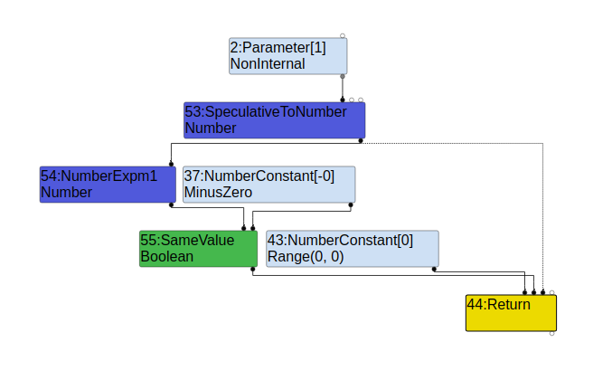
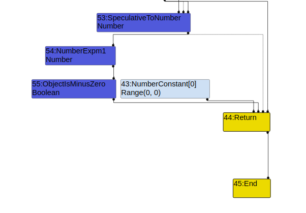
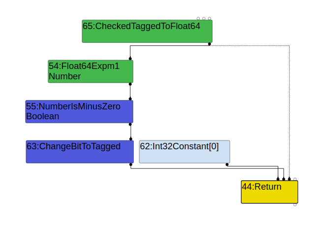
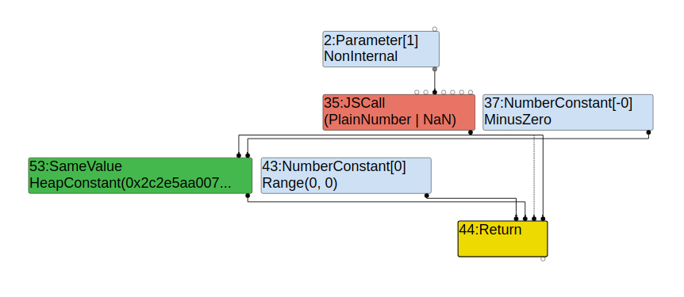
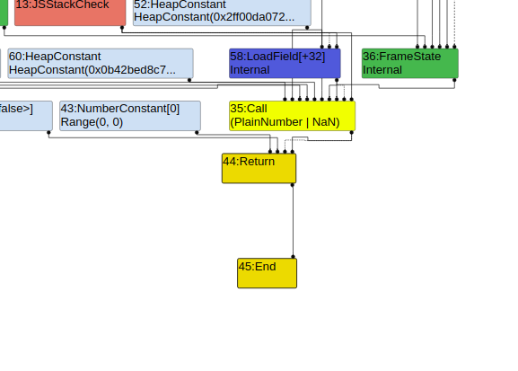
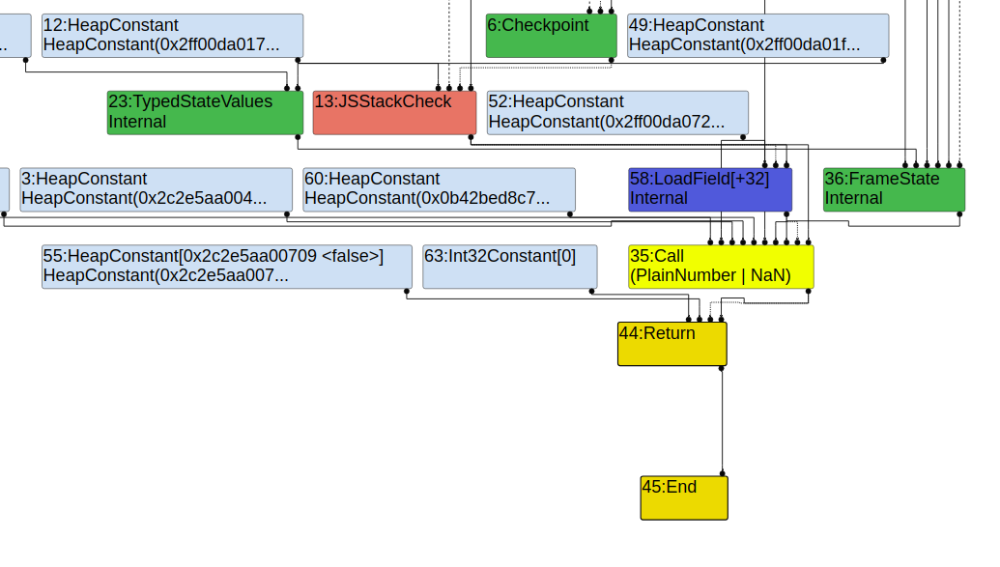
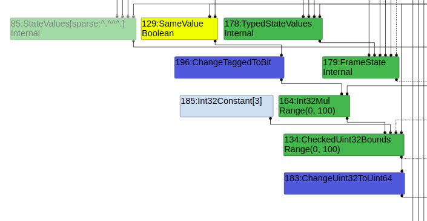
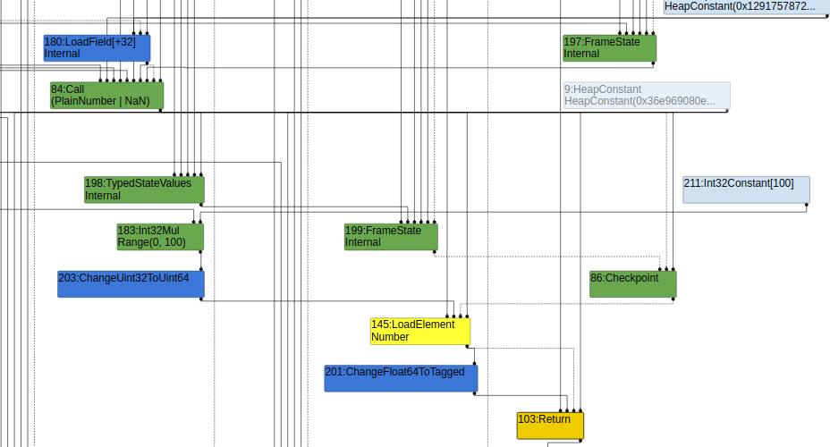

# Task 02: More v8 internals - 35C3 krautflare

## Info

* Date: 06/01/2021 - 09/01/2021

## Resources

* https://abiondo.me/2019/01/02/exploiting-math-expm1-v8/
* https://www.jaybosamiya.com/blog/2019/01/02/krautflare/
* https://de4dcr0w.github.io/35c3ctf-Krautflare%E5%88%86%E6%9E%90.html
* https://bugs.chromium.org/p/project-zero/issues/detail?id=1710
* https://confpad.io/2019-04-03-frontcon-2019/7-v8-by-example-a-journey-through-the-compilation-pipeline

## Questions

* Dive more into the pipeline. For this first time, I just follow some specific points of interest in the challenge. Will need to look more into each phase and what it does.

* Why does it compile twice?

    > This will print false. When running it, you’ll notice that the function is now compiled two times. You can add the --trace-deopt flag to be informed about deoptimizations. At first, foo will be interpreted. After a while, it gets compiled and optimistically optimized assuming x is a number. The first time the compiled function is called (with x as a string), we get a deoptimization:
    ```
    [...]
    ;;; deoptimize at <poc2.js:2:27>, not a Number or Oddball
    [...]
    ```
    > Feedback updated from deoptimization at <poc2.js:2:27>, not a Number or Oddball
    > It’s updating type feedback, telling Turbofan to not assume x is a number. The second time the function is compiled, Turbofan will generate a Call to the builtin. You’ll see you now have two Turbolizer traces. The most recent shows a Call node with type PlainNumber or NaN, as we expect.

    The first time compilation happens is at about 3500-ish time the function is run, even only with the string type, it compiled and the deopts right away. Then a while after that, it compiles again. **Deopt doesn't mean going back to nothing but using built-in function so it can handle more generic typess**

* Does it take the argument type into account in the first compilation?

    Still need to dig in to this, but may be it doesn't, because deopt happened.

* Still have problems with the Array layout but this is not the major concern of this task.

## V8 compilation pipeline (7.3.0)

First, it starts in `src/compiler/pipeline.cc`:

```C++
class PipelineImpl final {
 public:
  explicit PipelineImpl(PipelineData* data) : data_(data) {}

  // Helpers for executing pipeline phases.
  template <typename Phase>
  void Run();
  template <typename Phase, typename Arg0>
  void Run(Arg0 arg_0);
  template <typename Phase, typename Arg0, typename Arg1>
  void Run(Arg0 arg_0, Arg1 arg_1);

  // Step A. Run the graph creation and initial optimization passes.
  bool CreateGraph();

  // B. Run the concurrent optimization passes.
  bool OptimizeGraph(Linkage* linkage);

  // Substep B.1. Produce a scheduled graph.
  void ComputeScheduledGraph();

  // Substep B.2. Select instructions from a scheduled graph.
  bool SelectInstructions(Linkage* linkage);

  // Step C. Run the code assembly pass.
  void AssembleCode(Linkage* linkage);

  // Step D. Run the code finalization pass.
  MaybeHandle<Code> FinalizeCode();

  // Step E. Install any code dependencies.
  bool CommitDependencies(Handle<Code> code);

  void VerifyGeneratedCodeIsIdempotent();
  void RunPrintAndVerify(const char* phase, bool untyped = false);
  MaybeHandle<Code> GenerateCode(CallDescriptor* call_descriptor);
  void AllocateRegisters(const RegisterConfiguration* config,
                         CallDescriptor* call_descriptor, bool run_verifier);

  OptimizedCompilationInfo* info() const;
  Isolate* isolate() const;
  CodeGenerator* code_generator() const;

 private:
  PipelineData* const data_;
};
```

There are many phases in the pipeline, but just pay attention to the template and we can recognize how each phase is organized

* Each phase is a `struct ...Phase`
* Each has a `Run` method that carries out the logic of that phase
* Each phase has many passes that will be run on the graph used in the pipeline

Then we dive into the relevant phases in the challenge.

> Afaict, the typer runs 3 times:
> * in the typer phase
> * in the TypeNarrowingReducer (load elimination phase)
> * in the simplified lowering phase
> After the first two typing runs, the ConstantFoldingReducer will run, so if we get the typer to mark the Object.is result to always be false at this point it will simply be replaced with a false constant.
> That leaves the third typing round.


### Typer (typer.cc)

TODO

### Type Narrowing Reducer (type-narrowing-reducer.cc)

TODO

### Simplifed Lowering (simplified-lowering.cc)

TODO

## Experiments

### Experiment 1: Difference in the function call node
> However, there's one more obstacle you need to overcome. Using the naive approach, there will be a FloatExpm1 node in the graph. This node outputs a float and the SameValue node wants a pointer as input, so the compiler will insert a ChangeFloat64ToTagged node for conversion. Since the type information say that the input can never be -0, it will not include special minus zero handling and our -0 will get truncated to a regular 0.
> However, it's possible to make this a Call node instead, which will return a tagged value and the conversion does not happen.
* Without deopt
    * The function is only compiled once
    * Typer phase

        
        * Math.expm1 is a NumberExpm1 node of type Number, which includes -0
        * Object.is is a SameValue node of type Boolean
        * Param is NonInternal type, as an input to SpeculativeToNumber node of type Number
    * Typed Lowering phase

        
        * Object.is in replaced by an ObjectIsMinusZero node of type Boolean
    * Load Elimination nothing changed
    * Simplified Lowering phase

        
        * Math.expm1 is a Float64Expm1 node of type Number
        * Object.is is replaced by a NumberIsMinusZero of type Boolean, then goes into ChangeBitToTagged
* With deopt
    * First compilation is the same as before
    * Second compilation differs
    * Typer phase

        
        * Math.expm1: JSCall of type Union(PlainNumber, NaN)
        * Object.is: SameValue of type HeapConstant false
    * Typed Lowering

        
        * Math.expm1 is replaced by a Call node of type Union(PlainNumber, NaN)
        * Object.is node is gone? Because of constant folding? And this is when we do experiment 2
    * Load Elimination nothing changed
    * Simplified Lowering nothing significantly changed

        

### Experiment 2: Trigger bug at different phases

In the previous experiment, the bug was triggered really soon and constant folding happened, so the node is gone? Let's verify this.

* Find the code that is responsible for the constant folding (ConstantFoldingReducer)
    ```C++
    ...
    if (upper.IsHeapConstant()) {
        replacement = jsgraph()->Constant(upper.AsHeapConstant()->Ref());
    }
    ...
    ```
* Add 1 layer of indirection
    ```javascript
    function foo(x, y) {
        let arr = [MAGIC, MAGIC, MAGIC];
        let b = Object.is(Math.expm1(x), y);
        return arr[b * 100];
    }
    ```
    This results in the Object.is call kept as SameValue node of type Boolean until simplified lowering

    

* The previous code will keep the node until really late but we want to trigger slightly earlier

    ```javascript
    function foo(x) {
        let arr = [MAGIC, MAGIC, MAGIC];
        let o = {mz: -0}
        let b = Object.is(Math.expm1(x), o.mz);
        return arr[b * 100];
    }
    ```

    This results in the Object.is call kept as SameValue until escape analysis. But it is not folded into false constant. The BCE is performed during simplified lowering so we do not see it anymore here.

    

## Exploitation

* Goals
    * Avoid the Math.expm1 being convereted to ranges including -0
        * Need this to be a Call node, specifically for this challenge because the patch is only partially reverted.
        * A Call node is of type Union(PlainNumber, NaN)
        * => Therefore, need to deopt so Math.expm1 is made a Call node, by calling the function with a string argument. The first optimized version assume it is always a Number, whether or not it is passed a string the first time.
    * Avoid the Object.is node to be replaced by a false constant too soon. If it happens too soon, we will only access the first element, not getting an OOB. If it happens too late, it will make the result of the dependent index a Range type, for example, Range(0, 100), as in the experiment 2 above, and this node will not cause a Bound Check Elimination. We need to find out where the typing happens and make this happen at the proper phase. As mentioned in the bug report, it is the Escape Analysis phase. We cannot let turbofan knows that we are comparing with -0 until this phase.
* The turbofan-inferred type is the one that causes the bound check elimination, and the actual type is the one we get OOB. For example, turbo fan thinks the range is (0, 0) while the result at runtime can be (0, 100), it will use the first range to optimize graph.
